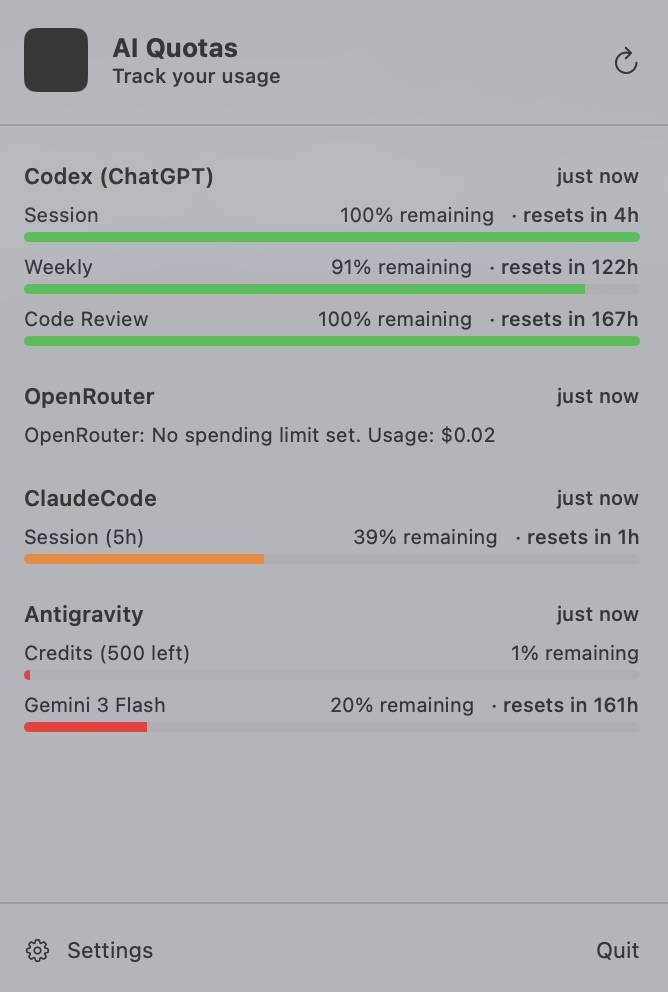

# AIQuota

[AIQuota](https://github.com/anantshri/AIQuotas) is a native macOS menu bar application designed to help developers track their AI service usage and quotas in real-time. It provides a centralized view of your remaining limits across various AI providers, ensuring you never run out of credits unexpectedly.

## Features

- **Real-time Quota Tracking**: Monitor session and weekly limits for multiple AI services.
- **Provider Support**:
    - **Antigravity**: Real-time tracking via seamless integration with the running Antigravity IDE or its language server.
    - **Claude Code**: Auto-detects session tokens from your local environment.
    - **Codex (ChatGPT)**: Tracks usage for the Codex interface.
    - **OpenRouter**: Monitors your credit balance and spending limits.
    - **DeepSeek**: Real-time balance tracking.
    - **OpenAI**: Monthly usage monitoring (requires admin API key).
- **Auto-Detection**: Automatically detects tokens for supported services from local configuration files and keychains.
- **Visual Feedback**: Stay informed with progress bars and status icons in your menu bar.
- **Secure Storage**: Sensitive information like API keys are stored securely using the macOS Keychain.

To use the Antigravity provider, you must have the Antigravity IDE or its language server running on your machine. The app connects to the local server to track your usage in real-time.

## Releases

This project uses GitHub Actions to automatically build and release the macOS application.

To create a new release:
1. Tag your commit with a version number (e.g., `git tag v1.0.0`).
2. Push the tag to GitHub (`git push origin v1.0.0`).
3. The "Release AIQuota" workflow will trigger, build the `.app` bundle, zip it, and create a new GitHub Release with the artifact attached.

## Credits

This project leverages logic and research from the [antigravity-usage](https://github.com/skainguyen1412/antigravity-usage) project for its Antigravity service integration, specifically for token detection, refresh logic, and local IDE communication.

## AI Assisted Development

This project was developed with significant assistance from **Antigravity**, an agentic AI coding assistant. The architecture, UI implementation, and many of the core service integrations were collaboratively designed and implemented by the AI and the developer.

## Built With

- **Swift & SwiftUI**: For a native, performant macOS experience.
- **Apple Keychain**: For secure credential storage.
- **Combine**: For reactive data updates.

---

*Note: This project is in active development. Features and provider support may evolve.*
